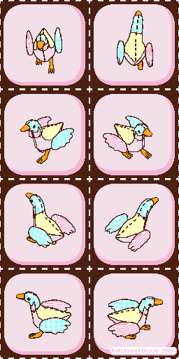

# Turntable Camera Render Helper

Blender add-on for rendering multiple views of an object/scene. The main use case is for game development where rendering out 2D sprites that require multiple facing directions manually is tedious and time consuming.

Inspired by the video ["How To Make Pixel Art in Blender - The Complete Guide"](https://youtu.be/PBIPJdEECWg?si=DGotZjQ2qhZyM6A-) by [@KitagawaGameDev](https://www.youtube.com/@KitagawaGameDev) on Youtube. You can see his original script here [rotation_render.py](https://gist.github.com/kit-agawa/94a18f982d5b1c016a119d4cbe25882f).

<video controls src="assets/example_video.mp4" type="video/mp4" title="Blender window showing the addon rendering an animation"></video>

Tested in Blender 5.0 on Windows 11.
